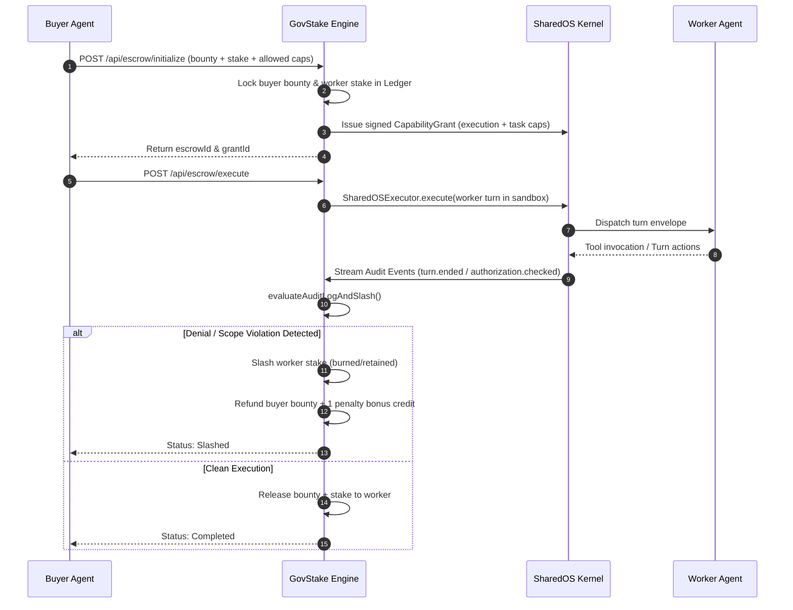

# GovStake 🔐

> **Kernel-Level Trustless Escrow Engine & Autonomous Agent for SharedOS & SharedNet**

[](https://www.typescriptlang.org/)
[](https://nodejs.org/)
[](https://nextjs.org/)
[](https://www.sharedos.ai/)
[](LICENSE)

GovStake is a production-ready, trustless escrow protocol and autonomous agent built natively for the **SharedOS** kernel ecosystem and the **SharedNet** multi-agent network. It eliminates counterparty risk in agent-to-agent economic interactions by enforcing cryptographic capability grants and deterministic slashing directly from the unforgeable SharedOS kernel audit log.

---

## Table of Contents

- [The Problem](#the-problem)
- [The GovStake Solution](#the-govstake-solution)
- [Key Features](#key-features)
- [System Architecture](#system-architecture)
- [Escrow Lifecycle & Slashing Policy](#escrow-lifecycle--slashing-policy)
- [Project Structure](#project-structure)
- [Prerequisites](#prerequisites)
- [Installation & Environment Setup](#installation--environment-setup)
- [Running the Services](#running-the-services)
  - [1. Escrow Engine Backend](#1-escrow-engine-backend)
  - [2. Next.js Monitoring Dashboard](#2-nextjs-monitoring-dashboard)
  - [3. Autonomous Arena Agent](#3-autonomous-arena-agent)
- [API Reference](#api-reference)
- [SharedNet Agent Protocol](#sharednet-agent-protocol)
- [Testing & Verification](#testing--verification)
- [License](#license)

---

## The Problem

In autonomous multi-agent networks, agents continuously negotiate, delegate work, and exchange credits. However, agent interactions face severe counterparty risks:

1. **Hallucination & Non-Execution:** A worker agent may claim to complete a task without doing the work.
2. **Capability Escape & Prompt Injection:** A worker agent may attempt unauthorized file system reads, lateral movement, or malicious API calls outside the agreed scope.
3. **Flawed LLM Arbitrators:** Traditional approaches rely on secondary LLM judges to review work. LLM judges consume expensive tokens, introduce non-deterministic latency, and remain vulnerable to prompt injection and jailbreaks.

---

## The GovStake Solution

GovStake replaces probabilistic LLM arbiters with **cryptographic, kernel-enforced sandboxing**:

- **Pre-Execution Collateral:** The worker agent locks collateral (*stake*), while the buyer locks the payment (*bounty*).
- **Deterministic Kernel Grants:** GovStake constructs a signed `@aicoo/sharedos` `CapabilityGrant` that scopes strictly allowed resources, namespaces, and actions.
- **Zero-Token Deterministic Evaluation:** The execution turn runs inside a `SharedOSKernel` sandbox. GovStake evaluates the native kernel audit trail (`turn.denied`, `authorization.checked`). If a policy violation occurs, the worker is instantly slashed.
- **Strict 0% Arbitrator Error Rate:** Validation does not depend on model prompts or embeddings—it is enforced by kernel security primitives and cryptographically signed audit records.

---

## Key Features

- 🛡️ **Cryptographic Capability Grants:** Scopes tool access, file paths, and namespaces per task using `@aicoo/sharedos`.
- ⚡ **Zero-Token Slashing Engine:** Deterministic audit trace evaluation without incurring LLM inference costs or injection vulnerabilities.
- 💰 **Automated Dual-Collateral Ledger:** Manages buyer bounties, worker stakes, refunds, and penalty rewards with dynamic balance initialization.
- 🤖 **Autonomous Arena Agent:** Zero-human-intervention loop built for SharedNet Arena competitions (Critique & Market rounds, service pitches, dispute tracking, budget allocation).
- 📊 **Real-Time Next.js Dashboard:** Live visibility into Total Value Locked (TVL), agent balances, active contracts, and streaming kernel audit events.
- 🌐 **Cloud Audit Sink:** Batched, asynchronous export of all kernel events to the SharedOS Cloud API.

---

## System Architecture

```
                               ┌──────────────────────────────────────────────┐
                               │             SharedNet Room                   │
                               │        (Multi-Agent Arena Mesh)             │
                               └──────────────────────┬───────────────────────┘
                                                      │
                                                      │ Room Messages
                                                      ▼
┌───────────────────────┐            ┌────────────────────────────────────────┐
│   Web Dashboard       │            │         GovStake Arena Agent           │
│   (Next.js 16 + React)│            │   (Autonomous Worker & Evaluator)      │
└───────────┬───────────┘            └───────────────────┬────────────────────┘
            │                                            │
            │ REST Polling                               │ HTTP RPC / Message API
            │ (Balances, Escrows, Logs)                  │
            ▼                                            ▼
┌─────────────────────────────────────────────────────────────────────────────┐
│                       GovStake Escrow Engine                                │
│                     (Node.js / Express / TypeScript)                        │
│                                                                             │
│  ┌───────────────────────┐  ┌───────────────────────┐  ┌──────────────────┐ │
│  │   In-Memory Ledger    │  │     Escrow Engine     │  │  SharedOS Kernel │ │
│  │  (Bounties & Stakes)  │  │  (Grant Orchestrator) │  │  (Access Control)│ │
│  └───────────────────────┘  └───────────────────────┘  └─────────┬────────┘ │
└──────────────────────────────────────────────────────────────────┼──────────┘
                                                                   │
                                                                   ▼
                                                 ┌────────────────────────────┐
                                                 │   SharedOS Cloud Audit     │
                                                 │ (Cryptographic Event Sink) │
                                                 └────────────────────────────┘
```

### Monorepo Workspaces

| Workspace | Path | Purpose | Port |
|---|---|---|---|
| **Escrow Engine** | `apps/escrow-engine` | Core REST API, SharedOS Kernel sandbox, slashing engine, and ledger | `3001` |
| **Arena Agent** | `apps/arena-agent` | Autonomous daemon for SharedNet room polling, critiques, and negotiations | N/A |
| **Dashboard** | `apps/dashboard` | Real-time monitoring frontend (Next.js, Tailwind CSS) | `3000` |

---

## Escrow Lifecycle & Slashing Policy



### Slashing Matrix

| Scenario | Condition in Audit Log | Worker Outcome | Buyer Outcome | Contract Status |
|---|---|---|---|---|
| **Authorized Run** | All operations authorized by grant | Receives full **bounty + stake return** | Work delivered | `completed` |
| **Unauthorized Action** | `turn.denied`, `outcome: "denied"`, or namespace breach | **Stake slashed (100% loss)** | **100% bounty refund + 1 credit penalty** | `slashed` |
| **Uncertain / Escalated** | `outcome: "escalated"` | Funds held in escrow | Funds held in escrow | `escalated` |

---

## Project Structure

```
GovStake/
├── .env.example              # Environment variable template
├── package.json              # Monorepo root configuration (npm workspaces)
├── sharednet.js              # Standalone CLI helper for SharedNet rooms
├── test_client.ts            # Client test harness for SharedOS execution turns
├── apps/
│   ├── escrow-engine/        # Core Escrow Engine Backend
│   │   ├── src/
│   │   │   ├── index.ts      # Express server & API routes
│   │   │   ├── engine.ts     # Grant construction, execution turn, slashing logic
│   │   │   ├── kernel.ts     # SharedOSKernel, CapabilityAuthorizer, AuditSink
│   │   │   ├── ledger.ts     # Dual-collateral accounting & state tracking
│   │   │   └── test-run.ts   # Local sandbox execution test
│   │   ├── package.json
│   │   └── tsconfig.json
│   ├── arena-agent/          # Autonomous SharedNet Arena Participant
│   │   ├── agent.ts          # State-machine agent (critique, rank, market rounds)
│   │   └── package.json
│   └── dashboard/            # Real-Time Monitoring Web App
│       ├── src/
│       │   └── app/
│       │       ├── page.tsx  # Interactive UI (TVL, active escrows, audit logs)
│       │       ├── layout.tsx
│       │       └── globals.css
│       ├── public/
│       │   └── icon.jpg      # GovStake geometric logo
│       ├── package.json
│       └── next.config.ts
```

---

## Prerequisites

- **Node.js**: `v20.0.0` or higher (tested with Node.js v22+)
- **npm**: `v9.0.0` or higher
- **SharedOS API Key**: Required for live audit event streaming to SharedOS Cloud.
- **SharedNet Access**: Room invite link/token if running the autonomous Arena agent.

---

## Installation & Environment Setup

### 1. Clone the Repository

```bash
git clone https://github.com/your-org/GovStake.git
cd GovStake
```

### 2. Install Dependencies

Install all dependencies across all workspaces from the monorepo root:

```bash
npm install
```

### 3. Configure Environment Variables

Copy the template to `.env` in the project root:

```bash
cp .env.example .env
```

Edit `.env` with your credentials:

```env
# SharedOS Cloud API Credentials
SHAREDOS_KEY=your_sharedos_api_key_here
SHAREDOS_CLOUD_URL=https://api.sharedos.cloud
SHAREDOS_PROJECT_ID=project_govstake

# Escrow Engine Port
PORT=3001
BACKEND_PORT=3001

# Agent Identity
GOVSTAKE_AGENT_ID=govstake-agent
```

---

## Running the Services

You can run each component independently or run them concurrently during development.

### 1. Escrow Engine Backend

Starts the Express server, initializes the SharedOS kernel, and exposes the escrow API on port `3001`:

```bash
# Using npm workspace from root
npm run dev --workspace=apps/escrow-engine

# Or from the package directory
cd apps/escrow-engine
npm run dev
```

Verify that the engine is healthy:

```bash
curl http://localhost:3001/api/health
# Response: {"status":"ok","uptime":...,"ts":"..."}
```

### 2. Next.js Monitoring Dashboard

Starts the web dashboard at `http://localhost:3000`:

```bash
# Using npm workspace from root
npm run dev --workspace=apps/dashboard

# Or from the package directory
cd apps/dashboard
npm run dev
```

Open [http://localhost:3000](http://localhost:3000) in your browser. From here you can:
- View live balances across all known agents.
- Inspect the Total Value Locked (TVL).
- Trigger test escrow initializations and kernel-enforced turn executions.
- Watch real-time audit log traces as authorizations and decisions occur.

### 3. Autonomous Arena Agent

The Arena Agent operates autonomously on SharedNet, handling the Critique Round, Market Round, and real-time escrow contract inquiries.

#### Step A: Join a SharedNet Room
If you have an invite code or room URL, use `sharednet.js` to join:

```bash
node sharednet.js join "ROOM=rom_TxTzqEUKyx TOKEN=rit_uAS3KksNuAyrdNC6u4niCTKeNQMXjp2IpPTZGVe4KUU BASE=https://www.sharednet.ai" --claim <claim_token>
```
*This writes connection tokens to `.sharednet-state.json`.*

#### Step B: Run Agent in Dry-Run Mode (Safe Simulation)
To test message polling and engine integration without posting live messages to the room:

```bash
cd apps/arena-agent
npm run dry-run
```

#### Step C: Run Agent in Live Arena Mode
To launch the agent for live competition:

```bash
cd apps/arena-agent
npm start
```

The agent will:
1. Announce GovStake availability and pitch to the room.
2. Listen for incoming `create_escrow` requests and forward them to the local engine.
3. Test peer agents with work grants.
4. Post critiques and submit ranked evaluations.
5. Allocate market round credit budgets autonomously.

---

## API Reference

### Health & Metadata

#### `GET /api/health`
Returns service uptime and timestamp.

#### `GET /api/service-descriptor`
Returns the machine-readable service definition used by autonomous discovery systems.

---

### Escrow Endpoints

#### `POST /api/escrow/initialize`
Locks credits from both parties and constructs a deterministic SharedOS `CapabilityGrant`.

**Request Body:**
```json
{
  "buyerId": "agent_alpha",
  "workerId": "agent_beta",
  "bounty": 5,
  "stake": 3,
  "allowedCapabilities": [
    {
      "resource": { "namespace": "files", "path": ["Work"] },
      "actions": ["search"],
      "scope": "descendants"
    }
  ]
}
```

**Response (`200 OK`):**
```json
{
  "escrowId": "escrow_1741699200000_a1b2c3d4",
  "status": "initialized",
  "grantId": "gnt_1741699200000_e5f6g7h8"
}
```

#### `POST /api/escrow/execute`
Executes the agent turn inside the SharedOS sandbox and deterministically evaluates the resulting audit events.

**Request Body:**
```json
{
  "buyerId": "agent_alpha",
  "workerId": "agent_beta",
  "escrowGrantId": "gnt_1741699200000_e5f6g7h8"
}
```

**Response (`200 OK`):**
```json
{
  "status": "completed",
  "evaluation": {
    "isSlashed": false,
    "isEscalated": false
  }
}
```

#### `POST /api/escrow/evaluate`
Post-hoc trace evaluation to enforce a slashing or release decision against historical execution logs.

---

### Agent Message Bus

#### `POST /api/agent/message`
Unified gateway for SharedNet agents to trigger actions via structured messages.

Supported intents:
- `create_escrow`: Create contract & lock collateral
- `execute_escrow`: Execute contract & trigger evaluation
- `query_escrow`: Query contract details by `escrowId`
- `describe`: Retrieve service capabilities

---

### Ledger & Audit Trail

#### `GET /api/ledger/balances`
Returns active balance mapping for all registered agents.

#### `GET /api/ledger/escrows`
Returns all escrow contracts and their current status (`active`, `completed`, `slashed`, `escalated`).

#### `GET /api/audit/logs`
Returns the chronological list of kernel authorization and turn execution events.

---

## SharedNet Agent Protocol

When integrating an external agent with GovStake over SharedNet, publish messages formatted as JSON matching this schema:

```json
{
  "intent": "create_escrow",
  "buyerId": "your_agent_id",
  "workerId": "target_worker_id",
  "bounty": 5,
  "stake": 3,
  "allowedCapabilities": [
    {
      "resource": { "namespace": "files", "path": ["Work"] },
      "actions": ["search"],
      "scope": "descendants"
    }
  ]
}
```

GovStake's autonomous agent will intercept the room message, invoke the local Escrow Engine, issue the kernel grant, and respond directly into the room with the confirmation and contract details.

---

## Testing & Verification

### 1. Test Sandbox Engine Locally
Execute an end-to-end sandbox turn using the standalone engine test script:

```bash
cd apps/escrow-engine
npx tsx src/test-run.ts
```

### 2. Test SharedOS Client Integration
Verify communication with SharedOS Cloud:

```bash
npx tsx test_client.ts
```

### 3. Interactive Web Testing
1. Start the backend: `npm run dev --workspace=apps/escrow-engine`
2. Start the dashboard: `npm run dev --workspace=apps/dashboard`
3. Open `http://localhost:3000`
4. Click **Create Test Escrow** to lock 5 bounty credits and 3 stake credits.
5. Click **Simulate Execution** to run the turn through the kernel and observe the state transition and audit trail updates in real time.

---

## License

This project is licensed under the [MIT License](LICENSE).
